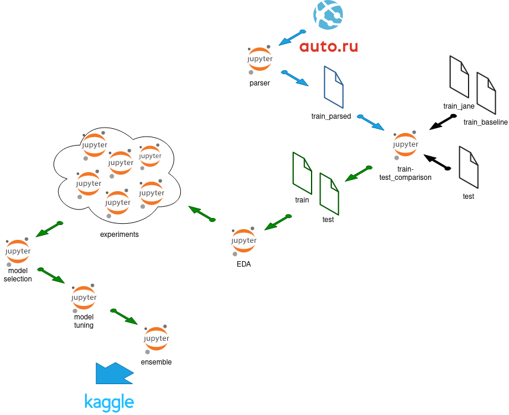

# Project 6: predicting car prices

Skillfactory, Data Science PRO course, [kaggle competition](https://www.kaggle.com/c/sf-dst-car-price-prediction)

Made by:

- Petr Polyakov - [Kaggle](https://www.kaggle.com/xelorrelin), [GitHub](https://github.com/XelorR), [GitLab](https://gitlab.com/XelorR)
- Michael Vasiliev - [Kaggle](https://www.kaggle.com/michaelvasiliev), [GitHub](https://github.com/MichaelDockers)

## Setup and requirements

There are two **requirements** files:

- [requirements.txt](requirements.txt) - used for data ingeneering, EDA and preprocessing. **Use it with python 3.10**
- [requirements_ml.txt](requirements_ml.txt) - used for ML. **Use it with python 3.8**
- [requirements_autoPyTorch.txt](requirements_autoPyTorch.txt) - deep learning focused on tabular data. **Use it with python 3.8**

Envirenment setup example:

```bash
git clone https://github.com/XelorR/sf_project_6
cd sf_project_6

python3 -m venv venv
source venv/bin/activate
./venv/bin/python3 -m pip install -r requirements.txt
```

## Workflow



### Notebooks

- [car_count](20220327_model_counts.ipynb)
- [parser](UsedCars_Project_Module_6_parser_20220401.ipynb)
- [train-test_comparison](2022-04-02_train-test_comparison.ipynb)
- [EDA](2022-03-31_train-test_EDA.ipynb)

### Data

#### Raw

- [train_jane](data/train_df_full_part1.pkl.zip) - dataset by [Jane Voytik](https://www.kaggle.com/datasets/eugeniavoytik/final-car-price-prediction-df-parsed-sep-2021)
- [train_sokolov](data/all_auto_ru_09_09_2020.pkl.zip)- dataset by [Aleksandr Sokolov](https://www.kaggle.com/datasets/sokolovaleks/parsing-all-moscow-auto-ru-09-09-2020)
- [test](data/test.pkl.zip) - test form [Kaggle](https://www.kaggle.com/c/sf-dst-car-price-prediction)
- [sample_submission](data/sample_submission.csv) - submission example from [Kaggle](https://www.kaggle.com/c/sf-dst-car-price-prediction)

#### Parsed

- [SPB](20220401_spb_parsed_data.pkl.zip)

#### Preprocessed

- [train](data/2022-04-06_train_preprocessed.pkl.zip)
- [test](data/2022-04-06_test_preprocessed.pkl.zip)
- [train_premodel](data/2022-04-08_train_pre-model.parquet)
- [test_premodel](data/2022-04-08_test_pre-model.parquet)


### Experiments

| Date       | Model                 | Made using file                        | MAPE   | Comments         | Kaggle |
|------------|-----------------------|----------------------------------------|--------|------------------|--------|
| 2022-04-08 | CatBoostRegrassor     | [EDA](2022-03-31_train-test_EDA.ipynb) | 13.76  |                  |        |
| 2022-04-08 | XGBRegressor          | [EDA](2022-03-31_train-test_EDA.ipynb) | 14.1   |                  |        |
| 2022-04-08 | RandomForestRegressor | [EDA](2022-03-31_train-test_EDA.ipynb) | 14.25  |                  |        |
| 2022-04-08 | AdaBoostRegressor     | [EDA](2022-03-31_train-test_EDA.ipynb) | 405.19 | dummy encoding   |        |
| 2022-04-08 | AdaBoostRegressor     | [EDA](2022-03-31_train-test_EDA.ipynb) | 562.54 | ordinal encoding |        |


## TO DO

- [x] org - Petr create repo, organize access
- [x] new - Petr - search for external datasets
- [x] new - Michael - create basic parser (first pages only)
- [x] new - Michael - expand parser to all pages for each model
- [x] new - Petr - compare Jane's train with test and insure feature consistency
- [x] org - both - align how to split and run parser on multiple machines 
- [x] fix - Michael - **get_urls_for_model_in_region** falling into infinite loop in case of too many pages
- [x] new - Petr - analyze [number of cars](20220327_model_counts.ipynb) to parse for each model and propose model split
- [x] new - both - run parser separately on several machines
    - [x] spb except bmw, mercedes, wolkswagen, mitsubishi
    - [x] spb mitsubishi
    - [x] spb bmw, mercedes, wolkswagen
    - [x] msk exclude mers and vw
    - [x] the rest
    - [x] spb catalog
- [x] new - Petr - update and push prefinal parser 
- [x] org - Petr - form a Kaggle Team
- [x] new - Petr - add "baseline" train dataset and ensure having same set of cols for all 3
- [x] new - both - implement feature-related comments from [2022-03-19_train-test_comparison.ipynb](2022-03-19_train-test_comparison.ipynb)
- [x] new - Michael - preprocess BodyType
- [x] new - multiplyer for price according to USD course (or some other idea)
- [x] new - start EDA
- [x] prepare first models and calculate feature importances
- [ ] new - combine parsed datasets
- [ ] new - make parsed compatible with test
- [ ] new - append parsed to test
- [ ] new - both - do experiments. A lot
